# App Instructions

## Introduction

This is an introduction to help walk you through the experience of the AI Playtesting prototype. The game we target is called Slay the Spire, a turn-based combat card game. Card designers (users) can design their decks and cards, then train an AI to playtest their sets of cards. AI will provide statistics like win rate, frequency of each card, etc. to help users balance their cards.

## Workflow
Start the application in 3 steps:

1. Unzip file in the desktop or some folder that doesn’t have a long path. One safe way is to unzip under C:// folder.

    (Windows has a path length limitation of 256 characters.)

2. Go to the path AIPABuild\BoardEngine-win32-x64, then open an executable file called BoardEngine. 

    (If a windows security warning pops up, you should select 'More info' and then 'run anyway' to proceed.)

3. Click GO to enter the application. 

Run the application in 3 steps:

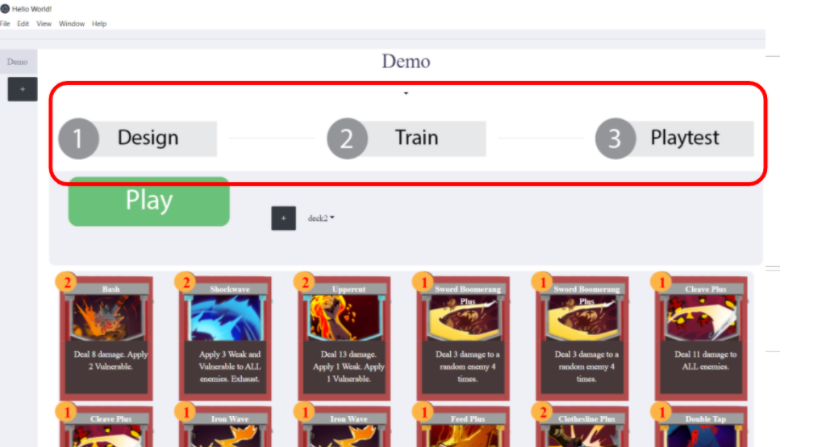

### 1. **Design**

**Play button**:** **Also known as human playtesting. It will open Unity games to play against the boss on your own.

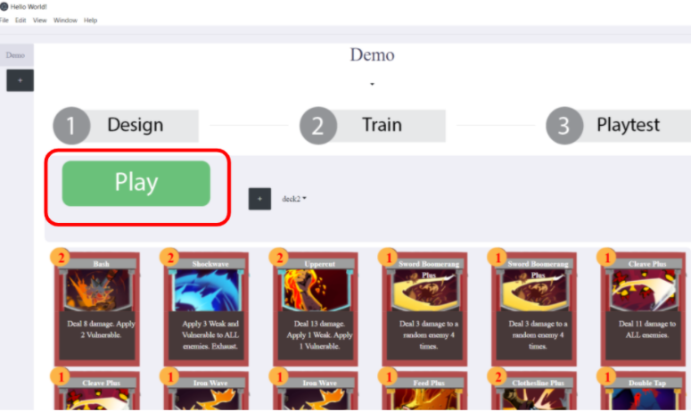

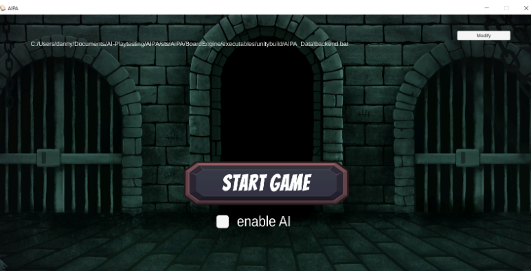

After Clicking on the Play button, you can click on State Game to play. Note that if “enable AI” is checked, the reward of each card is calculated and displayed when you are playing the game.

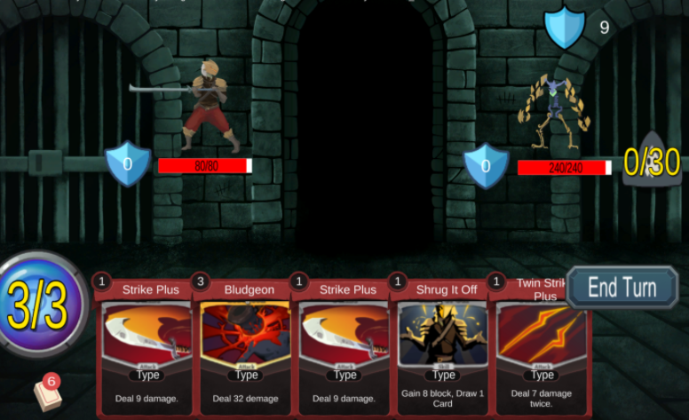

**Deck config**: select different decks that you want to play. Add button can add a new deck into this particular app.

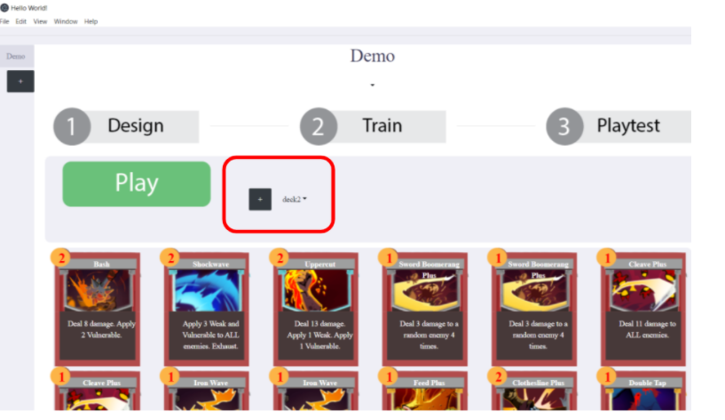

**Add or delete cards**: Add more cards in your deck, or delete cards that you don’t like.

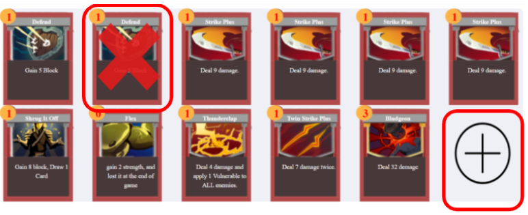

### 2. **Training:** 

Specify the number of iterations, then click on the Train button to train. Small number of iterations take less time to run, but may cause less accuracy rate. On the contrary, larger numbers of iterations take more time, but have a better chance to achieve a higher win rate. 

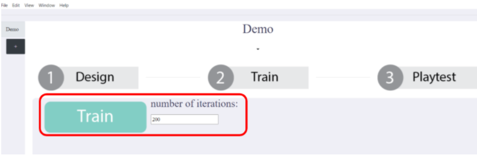

After clicking on the Train button, It will take some time, from a couple of minutes to hours, to run the training.

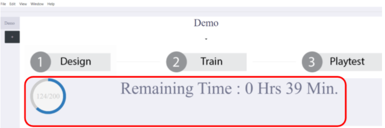

After the training is over, we can move on to the third part: playtest.

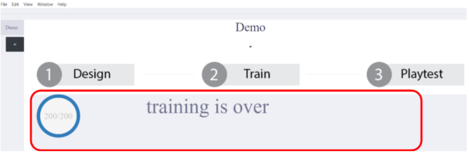

### 3. **Playtesting**: 
After training, we can run playtest to generate some statistics. Specify number of games to playtest, and select a trained model from the select bar on the third column, and then run playtest.

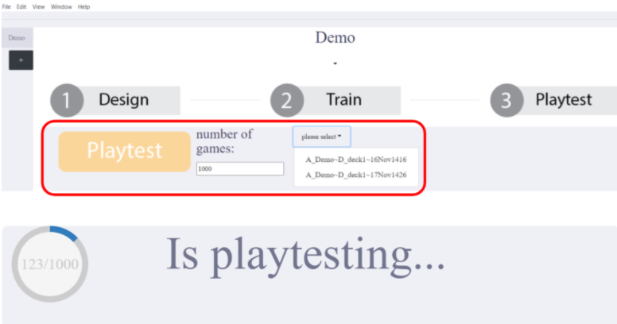

After playtesting is done, we can see statistics results as the graph below.

The leftmost pie chart is the win rate that AI played. Average game length means how many turns a game goes on average. Average player/boss hp means when a game ends, how much is the player’s/boss’s hp on average over all games playtested.

The rightmost bar chart shows various statistics for advanced designers.

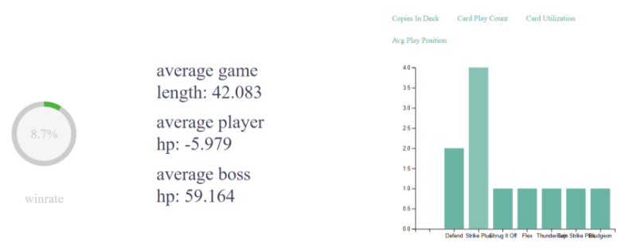

### Challenges to playtesters

1. Construct a deck that can achieve 100% win rate. 
2. Construct a deck that achieves around 50% win rate. That being said, form a balanced level of difficulty for other players.
3. Create a new card and add to a deck. Is it going to improve your win rate or not?